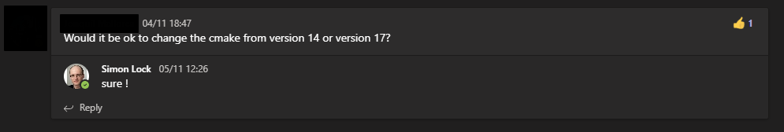

# Computer Graphics

Bristol COMS30020_2020 Computer Graphics (Y3), Coursework option

Confirmed mark: 72

## Usage

Run with arg `--animation` to render and save the video frames (see `animation.sh`)

Otherwise launches a keyboard controllable window: Use args `0-5` to choose which model to load (Textured, Cornell, Soft shadow, Hackspace, Sphere, Mirror) 

## Features

- OBJ geometry file loading
- OBJ material file loading

- Wireframe rendering
- Triangle rasterising
- Perspective corrected texture mapping for rasteriser

- Keyboard control of camera position
- Changing camera orientation (using orientation matrix)
- Camera LookAt

- Diffuse lighting (proximity and angle-of-incidence)
- Specular lighting
- Hard Shadow with Ambient lighting
- Gouraud shading
- Phong Shading
- Soft shadows
- Reflective Materials - A Mirror

## Building on Windows

```
git clone https://github.com/microsoft/vcpkg
.\vcpkg\bootstrap-vcpkg.bat
.\vcpkg\bootstrap-vcpkg.bat
.\vcpkg\vcpkg install sdl2:x64-windows
```

Set `-DCMAKE_TOOLCHAIN_FILE=C:\vcpkg\scripts\buildsystems\vcpkg.cmake`

Ensure working directory is set so the obj/mtl files can be found.

## Building on MVB Centos7



This project depends on C++17. However I later realised MVB machines do not support C++17

The `./mvb.sh` script can be used to download and compile GCC 10 (without root) and then run this project

